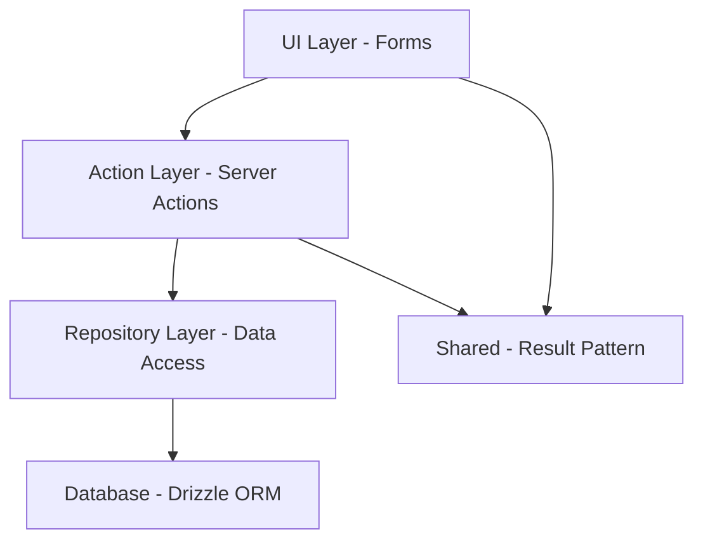

# Creating a New Module Feature

This workflow follows the established patterns from the `auth` and `resume` modules to ensure consistency across the application.

## Prerequisites

- Feature requirements clearly defined
- Database schema created (if needed)
- Zod validation schemas defined

## Pattern Overview

The project follows a layered architecture:



## Step 1: Create Module Structure

Create the following folder structure in `src/modules/[module-name]/`:

```
src/modules/[module-name]/
├── actions/          # Server actions only
├── components/       # React components
├── forms/           # Form components with validation
├── repositories/    # Database access layer
├── schemas.ts       # Zod schemas
└── index.ts         # Barrel exports
```

## Step 2: Define Schemas

Create `schemas.ts` with Zod validation schemas:

```typescript
import { z } from 'zod'

// Data schema
export const entityContentSchema = z.object({
  // Define your fields with validation
  name: z.string().min(1, 'Name is required'),
  // ... more fields
})

export type EntityContent = z.infer<typeof entityContentSchema>

// Create schema
export const createEntitySchema = z.object({
  // Required fields for creation
})

// Update schema
export const updateEntitySchema = z.object({
  id: z.string().uuid(),
  // Fields that can be updated
})
```

## Step 3: Create Repository

Create `repositories/[entity]-repository.ts`:

```typescript
import { db } from '@/infra/db/client'
import { entity } from '@/infra/db/schemas'
import { and, desc, eq } from 'drizzle-orm'

export class EntityRepository {
  /**
   * Create new entity
   */
  async create(userId: string, data: typeof entity.$inferInsert) {
    const [created] = await db
      .insert(entity)
      .values({ ...data, userId })
      .returning()
    
    return created
  }

  /**
   * Find by ID with ownership verification
   */
  async findById(id: string, userId: string) {
    return await db.query.entity.findFirst({
      where: and(
        eq(entity.id, id),
        eq(entity.userId, userId)
      ),
    })
  }

  /**
   * Find all by user ID
   */
  async findAllByUserId(userId: string) {
    return await db.query.entity.findMany({
      where: eq(entity.userId, userId),
      orderBy: [desc(entity.createdAt)],
    })
  }

  /**
   * Update entity
   */
  async update(id: string, userId: string, data: Partial<typeof entity.$inferInsert>) {
    const [updated] = await db
      .update(entity)
      .set(data)
      .where(and(
        eq(entity.id, id),
        eq(entity.userId, userId)
      ))
      .returning()
    
    return updated
  }

  /**
   * Delete entity
   */
  async delete(id: string, userId: string) {
    await db
      .delete(entity)
      .where(and(
        eq(entity.id, id),
        eq(entity.userId, userId)
      ))
  }

  /**
   * Verify ownership (helper)
   */
  async verifyOwnership(id: string, userId: string): Promise<boolean> {
    const entity = await this.findById(id, userId)
    return !!entity
  }
}

export const entityRepository = new EntityRepository()
```

## Step 4: Create Server Action

Create `actions/create-entity-action.ts`:

```typescript
'use server'

import { handleAuthError } from '@shared/errors/error-handler'
import { failure, type Result, success } from '@shared/errors/result'
import { entityRepository } from '../repositories/entity-repository'
import { type CreateEntityData, createEntitySchema } from '../schemas'

type CreateEntityOutput = {
  entityId: string
}

export const createEntityAction = async (
  userId: string,
  formData: CreateEntityData
): Promise<Result<CreateEntityOutput>> => {
  // 1. Validate input
  const validatedFields = createEntitySchema.safeParse(formData)

  if (!validatedFields.success) {
    return failure({
      type: 'VALIDATION_ERROR',
      error: 'Dados Inválidos',
      message: 'Por favor, corrija os campos destacados.',
      details: validatedFields.error.flatten().fieldErrors,
    })
  }

  try {
    // 2. Business logic (if any)
    const input = validatedFields.data

    // 3. Call repository
    const created = await entityRepository.create(userId, input)

    // 4. Return success
    return success({
      entityId: created.id,
    })
  } catch (error) {
    // 5. Handle errors
    return handleAuthError(error)
  }
}
```

**Key Points**:
- Always use `'use server'` directive
- Validate input with Zod schema
- Return `Result<T>` type (never throw)
- Use `success()` and `failure()` helpers
- Delegate DB operations to repository
- Handle errors with `handleAuthError` or custom handler

## Step 5: Create Form Component

Create `forms/create-entity-form.tsx`:

```typescript
'use client'

import { Alert, AlertDescription } from '@components/ui/alert'
import { Button } from '@components/ui/button'
import { Form, FormControl, FormField, FormItem, FormLabel, FormMessage } from '@components/ui/form'
import { Input } from '@components/ui/input'
import { Spinner } from '@components/ui/spiner'
import { zodResolver } from '@hookform/resolvers/zod'
import { isFailure, isSuccess } from '@shared/errors/result'
import { sleep } from '@utils/sleep'
import { redirect } from 'next/navigation'
import { useTransition } from 'react'
import { useForm } from 'react-hook-form'
import { toast } from 'sonner'
import { createEntityAction } from '../actions/create-entity-action'
import { type CreateEntityData, createEntitySchema } from '../schemas'

interface CreateEntityFormProps {
  userId: string
  onSuccess?: (entityId: string) => void
}

export function CreateEntityForm({ userId, onSuccess }: CreateEntityFormProps) {
  const [isPending, startTransition] = useTransition()

  const form = useForm<CreateEntityData>({
    resolver: zodResolver(createEntitySchema),
    defaultValues: {
      // Set default values
    },
  })

  const isSubmitPending = isPending || form.formState.isSubmitting

  const handleSubmit = (formData: CreateEntityData) => {
    form.clearErrors()

    startTransition(async () => {
      const result = await createEntityAction(userId, formData)

      // Handle failure
      if (isFailure(result)) {
        form.setError('root', {
          message: result.message,
        })

        toast.error(result.error || 'Ocorreu um erro', {
          description: result.message,
        })
        
        return
      }

      // Handle success
      if (isSuccess(result)) {
        toast.success('Criado com sucesso!')

        await sleep(1000)

        if (onSuccess) {
          onSuccess(result.data.entityId)
        } else {
          redirect(`/dashboard/entities/${result.data.entityId}`)
        }
      }
    })
  }

  return (
    <Form {...form}>
      <form className="flex flex-col gap-6" onSubmit={form.handleSubmit(handleSubmit)}>
        {/* Root error display */}
        {form.formState.errors.root && (
          <Alert variant="destructive">
            <AlertDescription>{form.formState.errors.root.message}</AlertDescription>
          </Alert>
        )}

        {/* Form fields */}
        <FormField
          control={form.control}
          name="fieldName"
          render={({ field }) => (
            <FormItem>
              <FormLabel>Field Label</FormLabel>
              <FormControl>
                <Input {...field} disabled={isSubmitPending} />
              </FormControl>
              <FormMessage />
            </FormItem>
          )}
        />

        {/* Submit button */}
        <Button disabled={isSubmitPending} type="submit">
          {isSubmitPending && <Spinner />}
          Criar
        </Button>
      </form>
    </Form>
  )
}
```

**Key Points**:
- Always use `'use client'` directive
- Use `useTransition` for pending state
- Use `react-hook-form` with `zodResolver`
- Check results with `isSuccess`/`isFailure`
- Show toasts for feedback
- Clear errors before submission
- Disable form during submission

## Step 6: Create Barrel Export

Create `index.ts`:

```typescript
// Actions
export * from './actions/create-entity-action'
export * from './actions/update-entity-action'
// ... more actions

// Components
export * from './components/entity-list'
// ... more components

// Forms
export * from './forms/create-entity-form'
export * from './forms/update-entity-form'

// Repositories
export * from './repositories/entity-repository'

// Schemas
export * from './schemas'
```

## Step 7: Write Tests

Create tests following the pattern:

```typescript
import { describe, it, expect } from 'vitest'
import { entityRepository } from './entity-repository'

describe('EntityRepository', () => {
  it('should create entity', async () => {
    // Test implementation
  })

  // More tests...
})
```

Run tests:
```bash
pnpm test
```

## Step 8: Update Application Pages

Use the new module in your pages:

```typescript
import { CreateEntityForm } from '@modules/[module-name]/forms/create-entity-form'
import { auth } from '@/lib/auth'

export default async function NewEntityPage() {
  const session = await auth()
  
  return (
    <div>
      <h1>Create New Entity</h1>
      <CreateEntityForm userId={session.user.id} />
    </div>
  )
}
```

## Verification Checklist

- [ ] All DB operations are in repositories
- [ ] Server actions use Result pattern
- [ ] Forms use useTransition and handle Result
- [ ] Input validation with Zod schemas
- [ ] Error handling with toasts
- [ ] Tests written and passing
- [ ] TypeScript compiles without errors
- [ ] Lint passes without warnings
- [ ] Manual testing completed

## Common Patterns

### Error Types

Use these error types from `@shared/errors/app-error`:
- `VALIDATION_ERROR` - Invalid input data
- `AUTHORIZATION_ERROR` - User not authorized
- `NOT_FOUND_ERROR` - Resource not found
- `CONFLICT_ERROR` - Resource conflict (duplicate)
- `INTERNAL_ERROR` - Unexpected server error

### Success Messages

For Portuguese messages, use:
- Creation: "Criado com sucesso!"
- Update: "Atualizado com sucesso!"
- Deletion: "Excluído com sucesso!"

### Failure Messages

- Validation: "Por favor, corrija os campos destacados."
- Authorization: "Você não tem permissão para realizar esta ação."
- Not Found: "Recurso não encontrado."
- Generic: "Ocorreu um erro. Tente novamente."

## References

- Auth Module: [`src/modules/auth`](file:///Users/gabs/Workspaces/c/studio-risine/mentorus/src/modules/auth)
- Resume Module: [`src/modules/resume`](file:///Users/gabs/Workspaces/c/studio-risine/mentorus/src/modules/resume)
- Result Pattern: [`src/shared/errors/result.ts`](file:///Users/gabs/Workspaces/c/studio-risine/mentorus/src/shared/errors/result.ts)
