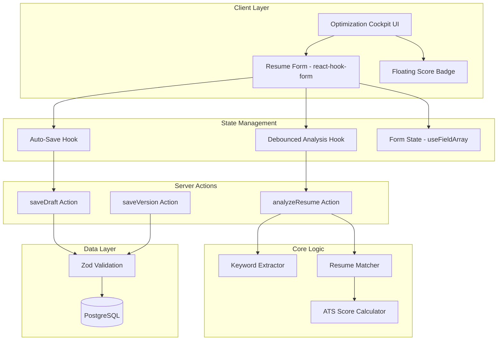

# Design Document: Optimization Cockpit

## Overview

The Optimization Cockpit is a split-screen interface that enables job seekers to optimize their resumes against specific job descriptions in real-time. The system extracts keywords from job descriptions, matches them against resume content, calculates an ATS compatibility score, and provides actionable feedback.

This design builds on the existing `ats-analyzer` module infrastructure, enhancing the `ResumeContent` schema to match the specified structure with separated skill categories (hard, soft, tools) and adding real-time analysis capabilities.

## Architecture



## Components and Interfaces

### ResumeContent Interface (Updated)

The core data structure that drives the entire system. This interface must be used consistently across UI, validation, and storage.

```typescript
// src/modules/ats-analyzer/types/resume-content.ts

export interface ResumeContent {
  basics: {
    name: string;
    email: string;
    phone?: string;
    label?: string; // Professional headline
    location: {
      city: string;
      region?: string;
      countryCode: string;
    };
    profiles: Array<{
      network: string; // e.g., "LinkedIn", "GitHub"
      url: string;
    }>;
  };
  summary: string;
  work: Array<{
    id: string;
    company: string;
    position: string;
    startDate: string; // ISO date string
    endDate?: string;
    isCurrent: boolean;
    summary: string; // Description used for keyword matching
  }>;
  education: Array<{
    id: string;
    institution: string;
    area: string; // Field of study
    studyType: string; // e.g., "Bachelor", "Master"
    startDate: string;
    endDate?: string;
  }>;
  skills: {
    hard: Array<{ name: string; level?: string }>; // High weight (60%)
    soft: string[]; // Medium weight (30%)
    tools: string[]; // Included in hard skills matching
  };
  languages: Array<{
    language: string;
    fluency: string; // e.g., "Native", "Fluent", "Intermediate"
  }>;
  meta: {
    template: string;
    completionScore: number; // 0-100
  };
}
```

### Component Hierarchy

```
OptimizationCockpitPage
├── CockpitHeader
│   ├── BackButton
│   ├── JobInfo (title, company, status)
│   └── ActionButtons (Re-Scan, Save Version)
├── ResizablePanelGroup
│   ├── JobDescriptionPanel (left, read-only)
│   │   ├── JobHeader
│   │   ├── JobContent
│   │   └── KeywordHighlighter
│   └── ResumeEditorPanel (right, editable)
│       ├── FloatingScoreBadge
│       ├── KeywordAnalysisBar
│       │   ├── MatchedKeywordsList
│       │   └── MissingKeywordsList
│       └── ResumeForm
│           ├── BasicsSection
│           ├── SummarySection
│           ├── WorkExperienceSection (useFieldArray)
│           ├── EducationSection (useFieldArray)
│           ├── SkillsSection
│           │   ├── HardSkillsInput
│           │   ├── SoftSkillsInput
│           │   └── ToolsInput
│           └── LanguagesSection (useFieldArray)
└── VersionHistoryDrawer
```

### Key Hooks

```typescript
// useOptimizationAnalysis - Debounced analysis trigger
interface UseOptimizationAnalysisOptions {
  jobDescription: string;
  debounceMs?: number; // Default: 500ms
}

interface UseOptimizationAnalysisReturn {
  analyze: (content: ResumeContent) => Promise<void>;
  result: AnalysisResult | null;
  isAnalyzing: boolean;
  score: number;
}

// useAutoSave - Debounced persistence
interface UseAutoSaveOptions {
  resumeId: string;
  debounceMs?: number; // Default: 2000ms
  maxRetries?: number; // Default: 3
}

interface UseAutoSaveReturn {
  save: (content: ResumeContent) => Promise<void>;
  status: 'idle' | 'saving' | 'saved' | 'error';
  lastSaved: Date | null;
}
```

## Data Models

### Database Schema Updates

The existing schema needs updates to support the new `ResumeContent` structure:

```typescript
// src/infra/db/schemas/resume-version.ts
export const resumeVersion = pgTable('resume_version', {
  id: text('id').primaryKey().$defaultFn(() => uuidv7()),
  resumeId: text('resume_id').notNull().references(() => resume.id, { onDelete: 'cascade' }),
  versionNumber: integer('version_number').notNull(),
  content: jsonb('content').notNull().$type<ResumeContent>(),
  atsScore: integer('ats_score'), // Score at time of save
  commitMessage: text('commit_message'),
  createdAt: timestamp('created_at', { withTimezone: true }).defaultNow().notNull(),
});

// src/infra/db/schemas/application.ts (existing, no changes needed)
// Links job + resume + status
```

### Zod Validation Schema

```typescript
// src/modules/ats-analyzer/schemas/resume-content.schema.ts

export const locationSchema = z.object({
  city: z.string().min(1, 'City is required'),
  region: z.string().optional(),
  countryCode: z.string().length(2, 'Country code must be 2 characters'),
});

export const profileSchema = z.object({
  network: z.string().min(1, 'Network name is required'),
  url: z.string().url('Must be a valid URL'),
});

export const basicsSchema = z.object({
  name: z.string().min(1, 'Name is required'),
  email: z.string().email('Must be a valid email'),
  phone: z.string().optional(),
  label: z.string().optional(),
  location: locationSchema,
  profiles: z.array(profileSchema).default([]),
});

export const workSchema = z.object({
  id: z.string().uuid(),
  company: z.string().min(1, 'Company is required'),
  position: z.string().min(1, 'Position is required'),
  startDate: z.string().min(1, 'Start date is required'),
  endDate: z.string().optional(),
  isCurrent: z.boolean().default(false),
  summary: z.string().min(1, 'Description is required'),
});

export const educationSchema = z.object({
  id: z.string().uuid(),
  institution: z.string().min(1, 'Institution is required'),
  area: z.string().min(1, 'Field of study is required'),
  studyType: z.string().min(1, 'Degree type is required'),
  startDate: z.string().min(1, 'Start date is required'),
  endDate: z.string().optional(),
});

export const hardSkillSchema = z.object({
  name: z.string().min(1, 'Skill name is required'),
  level: z.string().optional(),
});

export const skillsSchema = z.object({
  hard: z.array(hardSkillSchema).default([]),
  soft: z.array(z.string()).default([]),
  tools: z.array(z.string()).default([]),
});

export const languageSchema = z.object({
  language: z.string().min(1, 'Language is required'),
  fluency: z.string().min(1, 'Fluency level is required'),
});

export const metaSchema = z.object({
  template: z.string().default('default'),
  completionScore: z.number().min(0).max(100).default(0),
});

export const resumeContentSchema = z.object({
  basics: basicsSchema,
  summary: z.string().min(1, 'Summary is required'),
  work: z.array(workSchema).default([]),
  education: z.array(educationSchema).default([]),
  skills: skillsSchema,
  languages: z.array(languageSchema).default([]),
  meta: metaSchema,
});

export type ResumeContent = z.infer<typeof resumeContentSchema>;
```


## Correctness Properties

*A property is a characteristic or behavior that should hold true across all valid executions of a system-essentially, a formal statement about what the system should do. Properties serve as the bridge between human-readable specifications and machine-verifiable correctness guarantees.*

Based on the acceptance criteria analysis, the following properties must be verified through property-based testing:

### Property 1: Score Calculation Weighting

*For any* valid ResumeContent and job description, the ATS score calculation SHALL weight hard skills at 60%, soft skills at 30%, and keyword density at 10%. The final score must be between 0 and 100.

**Validates: Requirements 2.4**

### Property 2: Keyword Matching and Categorization

*For any* job description and ResumeContent, all matched keywords SHALL be correctly identified (keyword appears in both job and resume) and categorized into their respective groups (hard skills, soft skills, or general).

**Validates: Requirements 3.1, 3.2**

### Property 3: Gap Analysis with Priority Sorting

*For any* job description and ResumeContent, missing keywords SHALL be correctly identified (keyword in job but not in resume) and sorted by importance with hard skills appearing before soft skills.

**Validates: Requirements 4.1, 4.2**

### Property 4: Work Experience Array Invariants

*For any* work experience array, adding an entry SHALL increase the array length by 1, removing an entry SHALL decrease the array length by 1, and reordering SHALL preserve all entries (same length, same elements).

**Validates: Requirements 5.2**

### Property 5: Auto-Save Retry with Exponential Backoff

*For any* failed save attempt, the retry mechanism SHALL attempt exactly 3 retries with exponential backoff delays (e.g., 1s, 2s, 4s) before reporting final failure.

**Validates: Requirements 6.1, 6.3**

### Property 6: Version Number Monotonic Increment

*For any* resume, saving a new version SHALL result in a version number that is exactly 1 greater than the previous highest version number for that resume.

**Validates: Requirements 7.2**

### Property 7: Version Restoration Equivalence

*For any* saved version, restoring that version SHALL produce a ResumeContent object that is deeply equal to the content stored in that version.

**Validates: Requirements 7.4**

### Property 8: ResumeContent Round-Trip Serialization

*For any* valid ResumeContent object, serializing to JSON and then deserializing back SHALL produce an object that is deeply equal to the original.

**Validates: Requirements 8.3**

### Property 9: Validation Error Descriptiveness

*For any* invalid ResumeContent data, validation SHALL reject the data and return an error object containing at least one descriptive error message identifying the invalid field.

**Validates: Requirements 8.4**

## Error Handling

### Client-Side Errors

| Error Type | Handling Strategy |
|------------|-------------------|
| Validation Error | Display inline error messages next to affected fields; do not block other sections |
| Network Error (Auto-save) | Retry 3 times with exponential backoff; show error toast after final failure |
| Network Error (Analysis) | Show error toast; allow manual retry via Re-Scan button |
| Session Expired | Redirect to login with return URL |

### Server-Side Errors

| Error Type | Response | Client Action |
|------------|----------|---------------|
| Invalid ResumeContent | 400 Bad Request with Zod errors | Display validation errors |
| Application Not Found | 404 Not Found | Redirect to applications list |
| Unauthorized | 401 Unauthorized | Redirect to login |
| Server Error | 500 Internal Server Error | Show generic error toast |

### Error Response Format

```typescript
interface ErrorResponse {
  success: false;
  error: {
    code: string;
    message: string;
    details?: Record<string, string[]>; // Field-level errors from Zod
  };
}
```

## Testing Strategy

### Property-Based Testing Framework

The project will use **fast-check** for property-based testing in TypeScript/JavaScript. This library provides:
- Arbitrary generators for complex data structures
- Shrinking for minimal failing examples
- Integration with Vitest test runner

### Property-Based Tests

Each correctness property will be implemented as a property-based test with a minimum of 100 iterations:

```typescript
// Example structure for property tests
import fc from 'fast-check';
import { describe, it, expect } from 'vitest';

describe('ATS Score Calculator', () => {
  it('Property 1: Score calculation follows weighting formula', () => {
    // **Feature: optimization-cockpit, Property 1: Score Calculation Weighting**
    fc.assert(
      fc.property(
        resumeContentArbitrary,
        jobDescriptionArbitrary,
        (resume, jobDescription) => {
          const result = calculateATSScore(resume, jobDescription);
          // Verify score is in valid range
          expect(result.score).toBeGreaterThanOrEqual(0);
          expect(result.score).toBeLessThanOrEqual(100);
          // Verify weighting is applied correctly
          // ... additional assertions
        }
      ),
      { numRuns: 100 }
    );
  });
});
```

### Generators (Arbitraries)

Custom generators will be created for:

1. **ResumeContent Generator**: Generates valid ResumeContent objects with all required fields
2. **Job Description Generator**: Generates realistic job descriptions with keywords
3. **Invalid ResumeContent Generator**: Generates intentionally invalid data for error testing

### Unit Tests

Unit tests will cover:

1. **Keyword Extractor**: Specific keyword extraction scenarios
2. **Resume Matcher**: Edge cases in matching logic
3. **Score Calculator**: Boundary conditions (0%, 100%)
4. **Zod Schema**: Validation edge cases
5. **UI Components**: Rendering and interaction tests

### Test Organization

```
src/modules/ats-analyzer/
├── __tests__/
│   ├── arbitraries/
│   │   ├── resume-content.arbitrary.ts
│   │   └── job-description.arbitrary.ts
│   ├── properties/
│   │   ├── score-calculation.property.test.ts
│   │   ├── keyword-matching.property.test.ts
│   │   ├── gap-analysis.property.test.ts
│   │   ├── array-operations.property.test.ts
│   │   ├── auto-save.property.test.ts
│   │   ├── versioning.property.test.ts
│   │   ├── serialization.property.test.ts
│   │   └── validation.property.test.ts
│   └── unit/
│       ├── keyword-extractor.test.ts
│       ├── resume-matcher.test.ts
│       └── score-calculator.test.ts
```

### Test Coverage Requirements

- All 9 correctness properties must have corresponding property-based tests
- Each property test must run a minimum of 100 iterations
- Unit tests for edge cases not covered by property tests
- Integration tests for server actions (optional)

